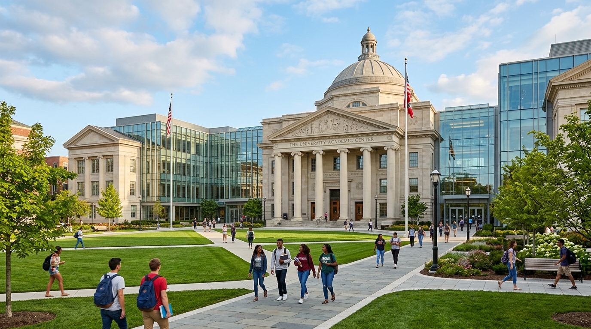

# ABC College of Technology - Official Webpage

A modern, responsive, and visually engaging institutional webpage for **ABC College of Technology**, built with semantic HTML5, CSS3, and JavaScript.



## 🌟 Key Features

1. **College Header**:
   - Prominently displays the institution name: **"ABC College of Technology"** with vibrant styling.
   - High-resolution campus architectural background with dark gradient overlay ensuring clear visibility and contrast.
   - Quick statistics highlighting 25+ years of excellence, 10,000+ alumni, 98% placement record, and 50+ modern laboratories.

2. **Navigation Bar**:
   - Fixed glassmorphism navigation header with links: **Home**, **About**, **Achievements**, and **Contact**.
   - Interactive mobile menu toggle for smaller screens.
   - Smooth scrolling and active section indicator on scroll.

3. **About & Introduction**:
   - Overview of the institution's mission and engineering excellence.
   - Detailed coverage of **Undergraduate (B.Tech)** and **Postgraduate (M.Tech, MBA, MCA)** academic programs.
   - Student facilities showcase: AI & Robotics labs, 24/7 Digital Library, Sports Complex, Smart Campus Wi-Fi, modern hostels, and hygienic cafeterias.

4. **Achievements**:
   - **Academic Excellence**: Top 10 rank, NAAC 'A++' grade, 99.4% pass rate, research patents.
   - **Sports Achievements**: 45+ national trophies, All-India Inter-University champions, international athlete representatives.
   - **Placement Records**: 98% placement record, packages up to ₹48 LPA, recruiters including Google, Amazon, Microsoft, and TCS.

5. **Interactive Admission Form**:
   - Student Name (text input)
   - Email (email input)
   - Phone Number (tel input)
   - Course Selection (dropdown with UG and PG options)
   - Gender selection (radio buttons: Male, Female, Other)
   - Submit button with client-side validation and toast confirmation feedback.

6. **Contact Information**:
   - Official College Address: *Knowledge Park III, Institutional Area, Tech City, PIN - 500081*
   - Phone Numbers (General inquiries & toll-free admission helpline)
   - Email addresses & office working hours
   - Interactive campus map navigation banner

## 🚀 Getting Started

Simply open `index.html` in any modern web browser or serve via a local server:

```bash
# Using Python
python -m http.server 8000

# Using Node.js
npx serve
```
